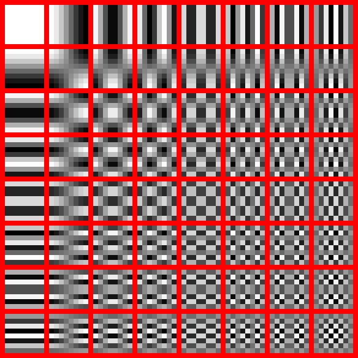

# JPEG

The most widely used digital image format, developed by Joint Photographic Experts Group. Several attempts has been made to replace it with something "better" (JPEG 2000 included), but it still helds its position. ISO/IEC and ITU-T standard, which only specifies the codec, but not the file format - the Exif and JFIF standards define the commonly used ones.

8 bit per channel, 3 channels, lossy, maximum 64k x 64k pixel resolution

## File format

A sequence of segments, each beginning with a marker. A marker is 2 bytes long, the first byte is 0xFF, the other byte indicates the type of the marker.

Examples:

- `FF D8` - SOI: start of image
- `FF D9` - EOI: end of image
- `FF C0` - SOF: start of frame (baseline DCT)
- `FF C2` - SOF (progressive DCT)
- `FF C4` - DHT: define Huffman tables
- `FF DB` - DQT: define quantization tables
- `FF DA` - SOS: start of scan (generally 1 for baseline, and multiple for progressive images)
- `FF E?` - APP? specific data (APP0 is JFIF and APP1 is Exif for example)
- `FF FE` - COMment

APP markers often begin with a standard or vendor name, like `JFIF\0` for JFIF. (Several vendors might use the same APPn marker type, they are not standardised.)
ICC profiles and such can be attached too.

### JPEG encoding

A JPEG file can be encoded in various ways, most commonly it is done with JFIF encoding:

1. Image colors are converted from RGB to YCbCr.
2. The resolution of chroma data is reduced - the human eye is less sensitive to color than brightness.
3. The image is split into 8x8 pixel blocks, each channel undergoes DCT.
4. The amplitudes of the frequency components are *quantized*. Human vision is more sensitive to small variations in color/brightness over large areas - the magnitude of the high-frequency components is reduced. (This is the quality setting of the JPEG, at very low quality high frequencies are discarded completely.)
5. The result is compressed with a variant of Huffman encoding (lossless).

### YCbCr

RGB: red, green, blue
YCbCr:

- Y: luma/luminescense - brightness (Y' is used for JPEG, which is gamma corrected Y)
- Cb: blue chroma - yellow-blue axis
- Cr: red chroma - green-red axis

YUV is basiclly the same but while Cb/Cr is scaled to 0-255 (or 16-235), U/V is the distance from the center, they can be negative (-127 - 128 for example, or -0.5 - 0.5).

### Chroma subsampling

Human eye can see brightness much better than color (due to the number of receptors in the eye - 120M rods vs 6M cones), so in a lossy scenario we can compress the chromatic information much more than brightness without noticing it.

`J:a:b`

- `J` - horizontal reference sample (usually 4)

- `a` - number of chromatic samples in the first row

- `b` - number of changes in chromatic samples between first and second row

(Long history of TV transmission encodings like SECAM, PAL and NTSC, backward compatibilty with B/W TVs, ...)

Examples

- `4:4:4` means no downsampling - rarely used (we can use RGB instead)

- `4:2:2` 1/2 horizontal resolution, 2/3 bandwidth - some high-end digital video formats

- `4:2:0` 1/2 horizontal + 1/2 vertical resolution, 1/2 bandwith - most widely used: MPEG, **JPEG**, DVD, WebP, ...

- ...

### Block splitting

Each channel is split into 8x8 blocks.

This basically means 8x8 pixel blocks for brightness (Y), and 16x16 pixel blocks for chromatic channels (Cb/Cr).

### DCT

Discrete Cosine Transform (~DFT, but only using **real** numbers)

Each block from the previous step is converted to a frequency-domain representation using DCT.

### Quantization

Human eye is good at seeing small differences in brightness, BUT not so good at distinguishing the exact strength of a high frequency brightness variation - this allows us to reduce the amount of information in the high frequency components.

Quantization matrices are defined in the standard, basically they are controlled by the `quality` setting of the JPEG images.

### Entropy coding

First run-lenght encoding then Huffmann cofing is used to compress the blocks, but since higher frequency components are reduced (eventually to 0), the best way to encode them in a zigzag pattern instead of line-by-line (so the RLE finds more 0s next to each other).

In progressive mode the zigzag pattern goes through all the blocks for each frequency (~), in non-progressive mode it goes block-by-block.

## Future

There were some attempts by the JPEG group to extend it, JPEG 2000, JPEG XT, JPEG XS, JPEG XR, some of them has special uses, some of them has patented technology, but none of them were able to replace the classic JPEG.

### JPEG XL

- ISO standard, 2021/2022 (standardization started in 2017)

- *to become the universal replacement*

- Features:
  
  - improved functionality and efficiency (compared to JPEG, PNG and GIF)
  
  - bigger dimensions (2^30-1 pixels on each side)
  
  - up to 4099 channels (RGB, CMYK, alpha, depth, thermal, ...)
  
  - independent tiles
  
  - progressive decoding
  
  - lossless option
  
  - photographic/synthetic mode
  
  - graceful quality degradation
  
  - perceptually optimized reference encoder
  
  - wide color gamut support
  
  - HDR support
  
  - animations
  
  - fast, no need for special hardware support (decoding is faster than WebP or AVIF)
  
  - royalty free with open source reference implementation
  
  - ponies, unicorns

- Support:
  
  - very new - reference implementation is from August 2022 (1 months old)
  
  - official: ImageMagick, Gimp, Krita, FFmpeg, ...
  
  - unofficial: plugins for KDE/Qt, Windows and macOS
  
  - browsers: Chromium* and Firefox (behind flag)
  
  - https://jpegxl.info/

## Links

- [JPEG Sandbox](https://jpeg-sandbox.glitch.me/)
- [JPEG Sandbox on github](https://github.com/OmarShehata/jpeg-sandbox)
- [Interactive Fourier](https://www.jezzamon.com/fourier/)
- [Unraveling the JPEG](https://parametric.press/issue-01/unraveling-the-jpeg/)
