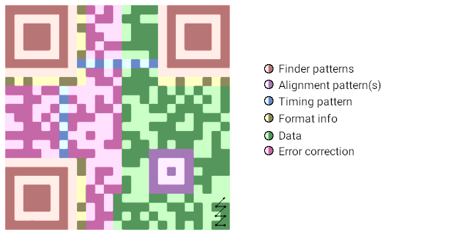
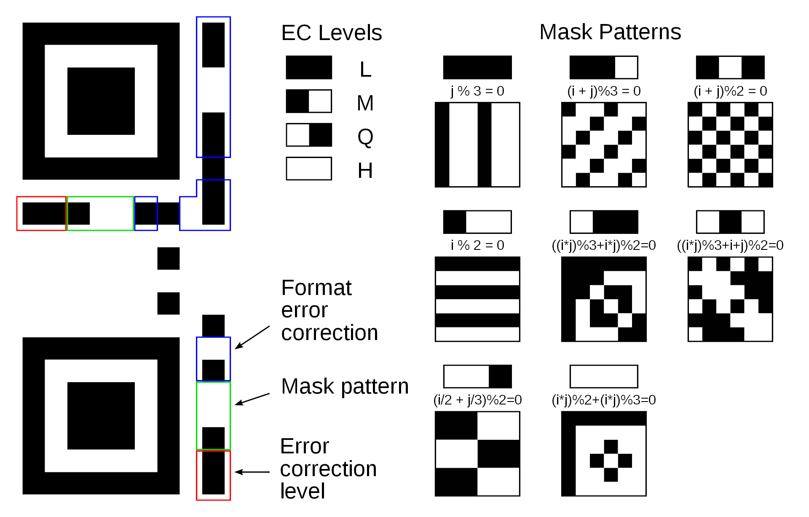
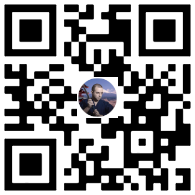

# QR Code

Invented by Denso Wave (japanese automotive company, subsidiary of Toyota) in 1994 to track vehicle parts during manufacturing. It was designed to allow high-speed scanning. Now it is used basically everywhere.

## Parts



- Finder patterns - helps the reader to detect the code

- Alignment pattern(s) - helps to align the QR code (especially big ones)

- Timing patterns - alternating black and white dots, the reader can detect the size (*version*, 1-40) of the QR code

- Format information - information about the used mask, error correction level and error correction format

- Data

- Error correction data

### Data

Four main encondings:

- **numeric** - 3⅓ bit/char - 0-9

- **alphanumeric** - 5½ bit/char - 0-9 + A-Z + space + some signs

- **binary** - 8 bit/char - bytes (ISO 8859-1 according to spec, but UTF-8 is fine)

- **kanji/kana** - 13 bit/char - Shift JIS X 0208 (better than binary/UTF-8)

Encoding modes can be mixed:

```
[mode1][size1][data1][mode2][size2][data2]...[EOM 0000]
```

The binary data is then padded to whole bytes with 0 bits, and padded to fit into the max available space using alternating `EC 11` pattern. Error correction data is calculated, then all the data is filled in in a zigzag pattern.

### Error correction data

Reed-Solomon error correction is used - it is very wide used, for example for CDs/DVDs, ... You probably don't want to know the details :)

**Levels / maximum data loss:**

- `11` - Low - 7%

- `10` - Medium - 14%

- `01` - Quartile - 25%

- `00` - High - 30%

### Format info

`10 100 01100100101`

- Error correction level: `10` - medium

- Mask pattern: `100`

- Error correction generator polinomial (you don't wanna know)

**Mask**

QR code readers work best when there are the same amount of black and white areas, and they are iterating. But real world data does not work this way, so there are 8 types of masks to apply (via XOR) and the best one is chosen.



*(image source: wikipedia.org)*

## Learn more

- [QR Code - Step by Step](https://www.nayuki.io/page/creating-a-qr-code-step-by-step)

- [QR Code Tutorial](https://www.thonky.com/qr-code-tutorial/)





